# PaytarAI — Sistem Diyagramları

**Tarih:** 2026-05-21
**Faz:** Phase 2 (BGE-reranker entegre)

Mermaid bloklarını VS Code'da "Markdown Preview" ile veya GitHub üzerinde açarsan render olur.

---

## 1. Üst Düzey Sistem Mimarisi

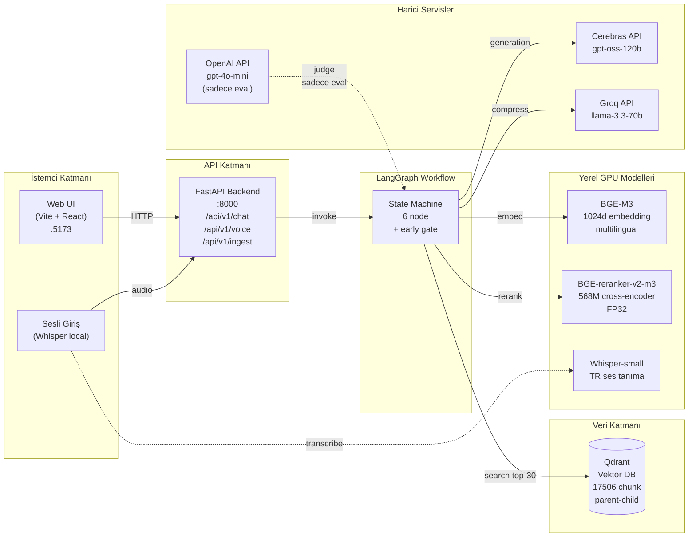

---

## 2. LangGraph Workflow — Node Akışı

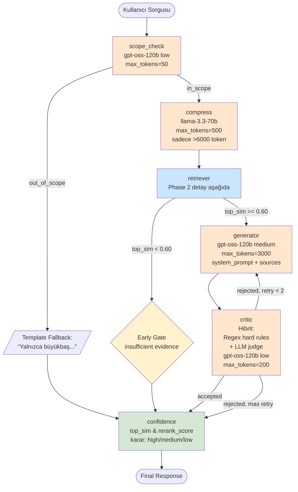

**Renk kodu:**
- 🟧 Turuncu = LLM çağrısı (Cerebras/Groq)
- 🟦 Mavi = Retrieval/Rerank (Lokal GPU)
- 🟨 Sarı = Karar noktası (kod, LLM yok)
- 🟩 Yeşil = Skorlama/sonlandırma

---

## 3. Retriever Node Detayı (Phase 2)

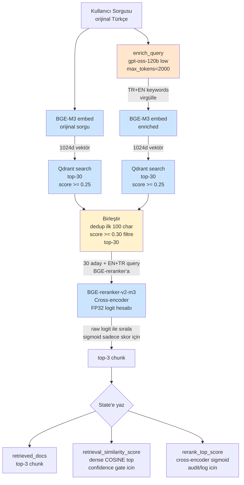

**Phase 2 vs Phase 1 farkı:**

| Aşama | Phase 1 | Phase 2 |
|---|---|---|
| enrich_query | KIRIK (reasoning=medium + 800 tokens → content boş) | DÜZGÜN (low + 2000) |
| Dense top-K | 5 | **30** |
| Reranker | yok | **BGE-reranker-v2-m3** ✨ |
| Generator'a giden | 5 chunk | **3 chunk (rerank top-3)** |

---

## 4. Critic Node — Hibrit Kontrol Detayı

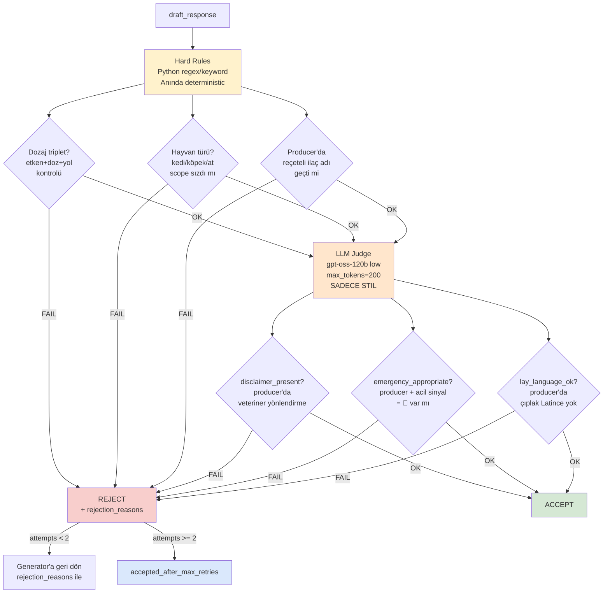

**Critic'in 3 katmanı:**
1. **Hard rules** (Python kodu, anında): Halüsinasyon önleme (dozaj, scope, ilaç adı)
2. **LLM judge** (Cerebras, ~0.5s): Stil kontrolü (disclaimer, acil işareti, sade dil)
3. **Retry loop** (max 2x): Generator'a rejection_reasons ile geri

---

## 5. State Şeması (LangGraph AgentState)

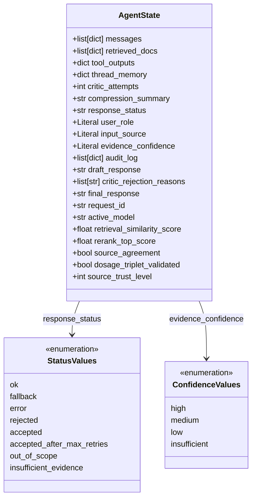

**Tip işlevleri:**
- `messages`: konuşma geçmişi
- `retrieved_docs`: reranker'dan gelen top-3
- `critic_attempts`: kaç kez critic reddetti (max 2)
- `retrieval_similarity_score`: DENSE cosine (confidence gate için)
- `rerank_top_score`: cross-encoder sigmoid (audit için)
- `audit_log`: her node'un kararı zaman damgalı

---

## 6. Eval Altyapısı

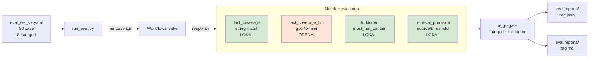

**Önemli ayrım:**
- 🟩 Yeşil metrikler: deterministik (lokal kod), varyans yok
- 🟧 Turuncu metrik: LLM judge, **varyansa açık** — Phase 2'de bu varyans yanıltıcı puanlar verdi

---

## 7. 50-case Eval Set Dağılımı

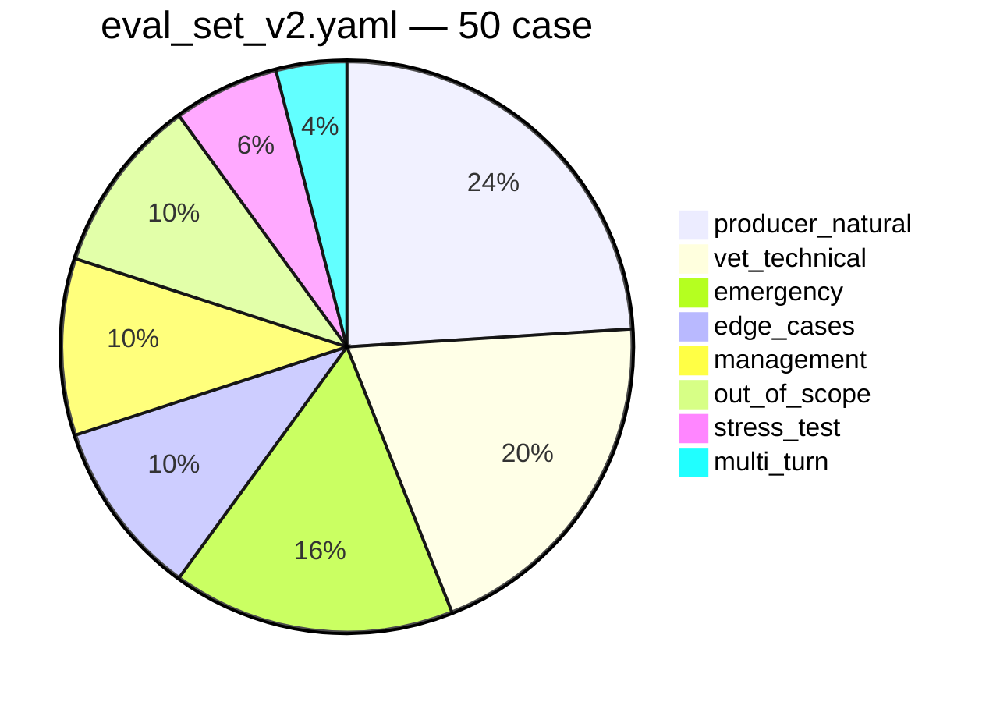

**Yazım stili dağılımı:**
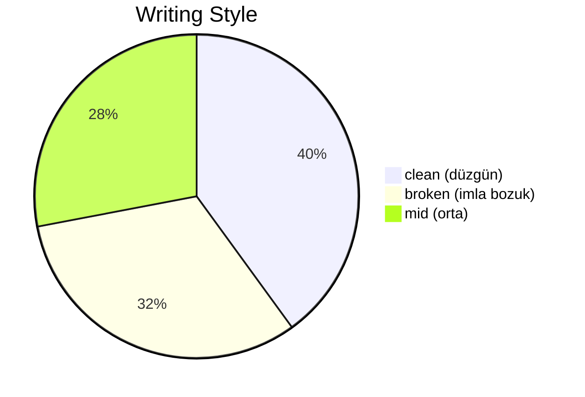

---

## 8. Phase 0 → Phase 2 Evrim Tablosu

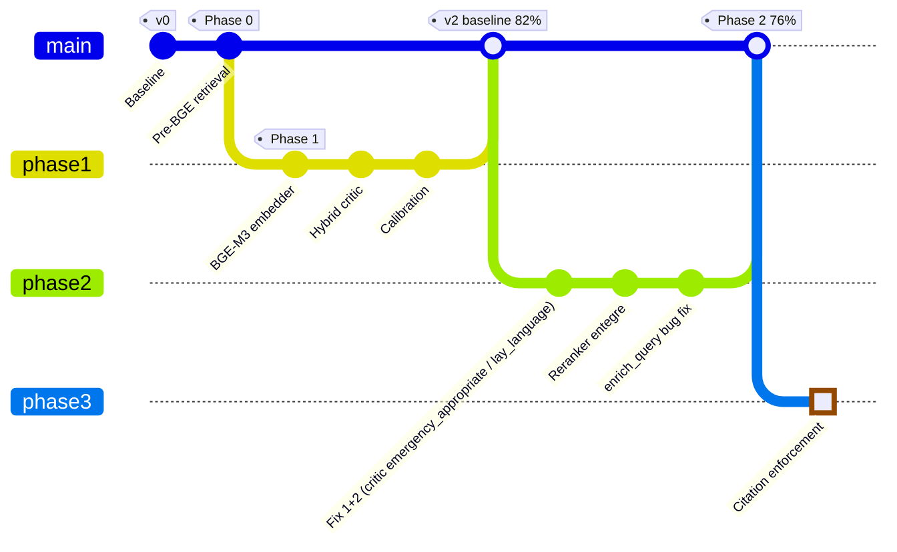

---

## 9. Model Bağımlılık Matrisi

| Node | Provider | Model | reasoning | Token | Latency | Maliyet |
|---|---|---|---|---|---|---|
| scope_check | Cerebras | gpt-oss-120b | low | max 50 | ~0.5s | $ |
| compress | Groq | llama-3.3-70b | n/a | max 500 | ~1s | $ (sadece >6k token) |
| enrich_query | Cerebras | gpt-oss-120b | low | max 2000 | ~1s | $ |
| **Retriever embed** | **Lokal** | **BGE-M3** | **n/a** | **n/a** | **~0.1s** | **GPU only** |
| **Retriever rerank** | **Lokal** | **BGE-reranker-v2-m3** | **n/a** | **n/a** | **~2-3s** | **GPU only** |
| generator | Cerebras | gpt-oss-120b | **medium** | max 3000 | **~30-50s** ⚠️ | $$$$ |
| critic LLM judge | Cerebras | gpt-oss-120b | low | max 200 | ~0.5s | $ |
| (eval) fact_llm | **OpenAI** | **gpt-4o-mini** | n/a | max 10 | ~0.3s | $ |

**En pahalı:** Generator (medium reasoning = uzun süre + yüksek token). Tipik query ~45s sürer, generator bunun %90'ı.

---

## 10. Veri Akışı — Tek Bir Query Örneği

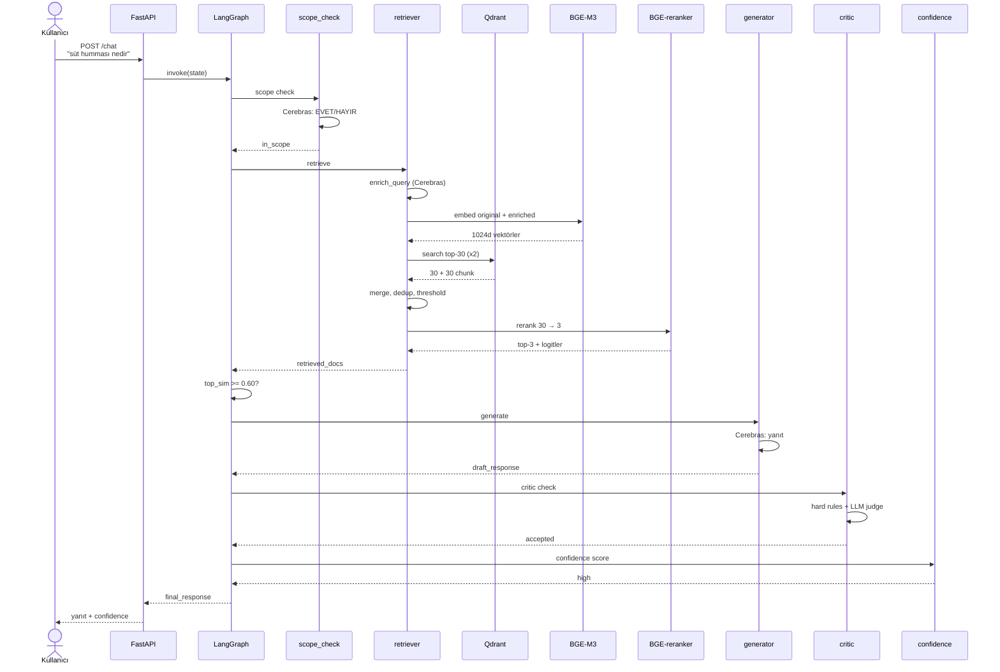

---

## 11. Phase 2 Pass Rate — Mevcut Durum (Doğru Eşik 0.66)

```mermaid
xychart-beta
    title "Production Pass Rate — Kategori Bazlı"
    x-axis ["producer", "vet", "edge", "stress", "emergency", "management", "OOS", "multi"]
    y-axis "Pass Rate %" 0 --> 100
    bar [75, 70, 80, 67, 100, 100, 100, 50]
    bar [92, 50, 40, 33, 100, 100, 100, 50]
```

**Mavi = v2 baseline, Turuncu = Phase 2 (renkler MD viewer'a bağlı)**

Producer kategoride **+17%** kazanç (enrich_query + reranker etkili), vet/edge/stress kategorilerinde kayıp.

---

## Notlar

- Bu diyagram dosyası **mermaid** kullanıyor — VS Code "Markdown Preview Mermaid Support" eklentisi ile veya GitHub'da otomatik render olur.
- PNG export için: VS Code'da preview aç → ekran görüntüsü, veya `mmdc` CLI ile (mermaid-cli) komut satırından SVG/PNG'ye çevir.
- Tez için: diyagramlardan birinden başlayabilirsin (#2 Workflow veya #3 Retriever) — bunlar projenin **çekirdek katkısı** olan iki katmanı görselleştiriyor.
